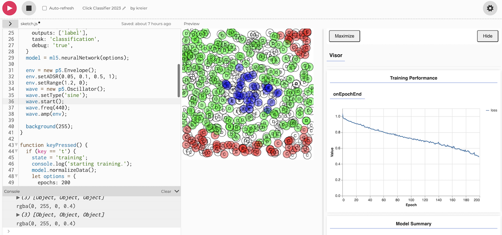
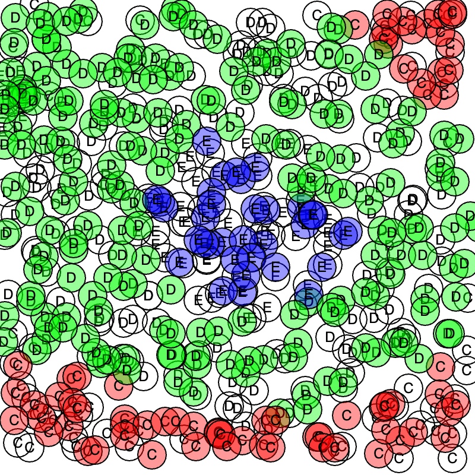

# Train your neural network - with a click

Daniel Shiffman made a great [Youtube video](https://youtu.be/8HEgeAbYphA) for his channel [Codingtrain](https://thecodingtrain.com/) in November 2019. The code on p5js creates something like this:

For this complicated example it might be better to increase the epochs to a larger number. For example the training 'E' on the left side are still ignored. More time would lead to a better model.

This was used 2021-2022 and 2022-2023 at SSIS for [Advanced Automation](https://sites.google.com/ssis.edu.vn/automation)
